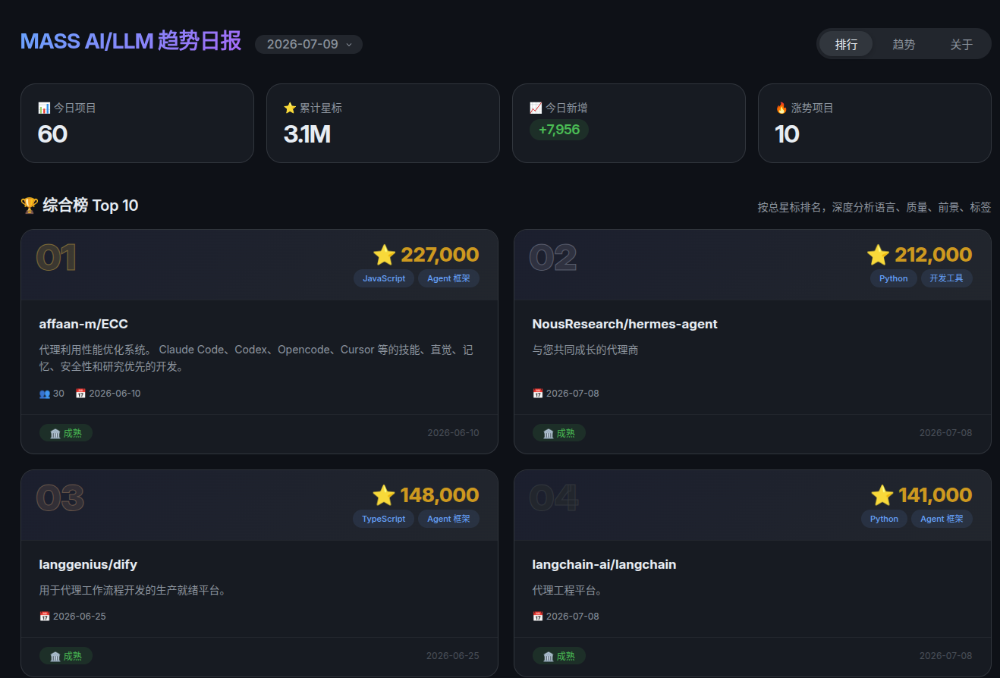
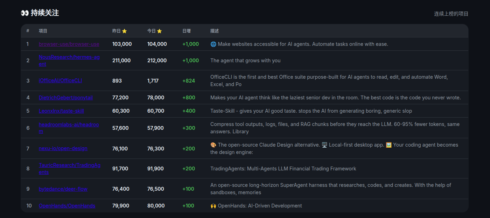

# GitHub Trending Loop

[](https://www.python.org/)
[](LICENSE)

每日自动追踪 GitHub AI/LLM/Agent 热门项目，多源数据融合，生成本地日报 + Web 仪表盘。

## 为什么做这个

GitHub Trending 只看日增，Topics 只看总量，HackerNews 只看热度——单一的视角无法反映项目的真实趋势。Trending Loop 将多个数据源合并去重，从**总量**、**日增**、**跨天动量**、**跨周增长**四个维度交叉分析，帮你发现真正的趋势项目，而不是"一日游"。

## 数据源

| 数据源 | 提供数据 | 用途 |
|--------|---------|------|
| GitHub Trending (daily) | 日增 Star、语言、描述 | 涨势榜排序 |
| Topics: ai-agents | 总 Star、标签、描述 | 综合榜排序 |
| Topics: llm-agent | 总 Star、标签、描述 | 合并去重 |
| Topics: agent | 总 Star、标签、描述 | 合并去重 |
| 项目详情页 | 创建日期、License、贡献者 | 元信息补充 |

## 功能

### 排行（当日快照）

- 🏆 **综合榜 Top 10**: 按总星标排名，照片卡片布局，含描述、语言、分类、标签、License、贡献者
- 🚀 **涨势榜 Top 10**: 按今日新增 Star 排名，总星标从历史数据累加计算

### 趋势（跨天/跨周动量）

- 👀 **持续关注**: 昨天和今天都有数据且增长的项目，按日增量排序，识别持续热度
- 📈 **本周增速**: 7 天 Star 增量排名，过滤短期波动，反映中长期增长趋势
- 📊 **类型分布**: 今日追踪项目的分类统计，含可视化进度条
- 🔤 **语言分布**: 按编程语言统计，未知语言单独归类

### 仪表盘

- 🌙 深色主题（GitHub 风格），响应式布局
- 📅 日期切换：下拉选择历史日报，回溯任意日期
- 🌐 一键翻译：项目描述 Google 翻译英译中
- 🔗 直达 GitHub 项目页
- 📸 照片卡片：排名水印 + 封面布局

## 截图

### 排行



### 趋势



## 数据流

```
GitHub Trending (日增Star) ──┐
Topics: ai-agents (总Star)  ─┤
Topics: llm-agent            ─┼─→ 合并去重 → AI 相关过滤
Topics: agent                ─┤         ↓
                              │   详情抓取（Top 18）
                              │         ↓
                              │   AI 分类 + 质量评分
                              │         ↓
项目详情页 (License/贡献者)   ─┘   日报 Markdown + Web API
```

### 项目分类

基于关键词匹配，自动将项目归入以下类别：

| 分类 | 关键词示例 |
|------|-----------|
| Agent 框架 | agent framework, multi-agent, agentic, orchestration |
| 开发工具 | cli, copilot, coding agent, sandbox, harness |
| RAG/检索 | rag, retrieval, embedding, vector, context |
| 推理/部署 | inference, deployment, serving, optimization |
| 模型 | model, fine-tune, lora, pretrain, transformer |
| 多模态 | vision, multimodal, text-to-image, speech |
| 评估/安全 | benchmark, eval, safety, alignment |
| 学术/教育 | paper, tutorial, course, research |

### 质量评分

综合 5 个维度评分（满分 100）：

- **活跃度** (25%): 近期 commit 频率、Star 增速
- **社区** (25%): 贡献者数量、Issue 活跃度
- **文档** (20%): README 完整度、是否有文档站点
- **增速** (20%): 日增 Star 绝对值
- **成熟度** (10%): License 清晰度、项目年龄

## 项目结构

```
github-trending-loop/
├── src/                    # 源代码
│   ├── fetch_trending.py   # 数据抓取 + 分类 + 评分 + 日报生成
│   └── server.py           # Web 仪表盘 API 服务
├── scripts/                # 脚本
│   ├── run-loop.sh         # cron 入口
│   ├── start-server.sh     # 启动 Web 服务
│   └── setup-cron.sh       # 设置定时任务
├── dashboard/              # Web 前端
│   └── index.html          # 单页仪表盘（原生 JS，深色主题）
├── docs/                   # 文档
│   ├── LOOP.md             # 循环规格（12 步流水线）
│   ├── STATE.md            # 状态文件（去重索引 + 验证清单）
│   ├── CLAUDE.md           # 项目规则
│   └── knowledge-base.md   # 长期知识沉淀
├── skills/                 # Claude Code Skills
│   └── github-trending-scanner/
├── tests/                  # 测试
└── data/                   # 运行时数据（gitignore）
    ├── raw/                # 原始抓取 JSON
    ├── processed/          # 结构化数据 + 星标历史
    └── output/             # 日报 Markdown
```

## API 端点

| 端点 | 说明 |
|------|------|
| `GET /api/dates` | 所有可用日期列表 |
| `GET /api/report?date=YYYY-MM-DD` | 指定日期的完整报告 |
| `GET /api/history?repo=owner/name` | 单个项目的历史星标数据 |
| `GET /api/overview` | 全局概览（追踪项目数等） |

## 快速开始

### 环境要求

- Python 3.8+
- Linux / macOS（cron 定时任务）
- 网络访问 github.com

### 1. 手动运行一次

```bash
cd github-trending-loop
python3 src/fetch_trending.py
```

### 2. 启动 Web 仪表盘

```bash
bash scripts/start-server.sh
# 打开 http://localhost:8080
```

### 3. 设置每天自动运行

```bash
bash scripts/setup-cron.sh
# 每天 8:00 自动抓取，日志输出到 cron.log
```

## 技术栈

- **Python 3** 标准库：`urllib` + `json` + `http.server`，零外部依赖
- **HTML/CSS/JS** 原生：零框架，单文件仪表盘
- **Linux cron** 定时调度
- **数据存储**：JSON 文件 + Markdown 日报，Git 友好

## 数据存储

每天运行产生三层数据，全部可审计、可回溯：

```
data/
├── raw/YYYY-MM-DD/           # 原始抓取（不可变，审计用）
│   ├── trending.json         # GitHub Trending 原始结果
│   ├── topics-ai-agents.json # Topics 页面结果
│   ├── topics-llm-agent.json
│   ├── topics-agent.json
│   └── all-candidates.json   # 手动筛选后的候选
├── processed/YYYY-MM-DD/     # 结构化数据
│   ├── candidates.json       # 分类 + 评分后的完整列表
│   └── top10.json            # 综合榜 Top 10
├── processed/history/        # 长期追踪（跨日）
│   └── owner__repo.json      # 每个项目的星标历史
└── output/YYYY-MM-DD.md      # 日报 Markdown
```

## License

MIT